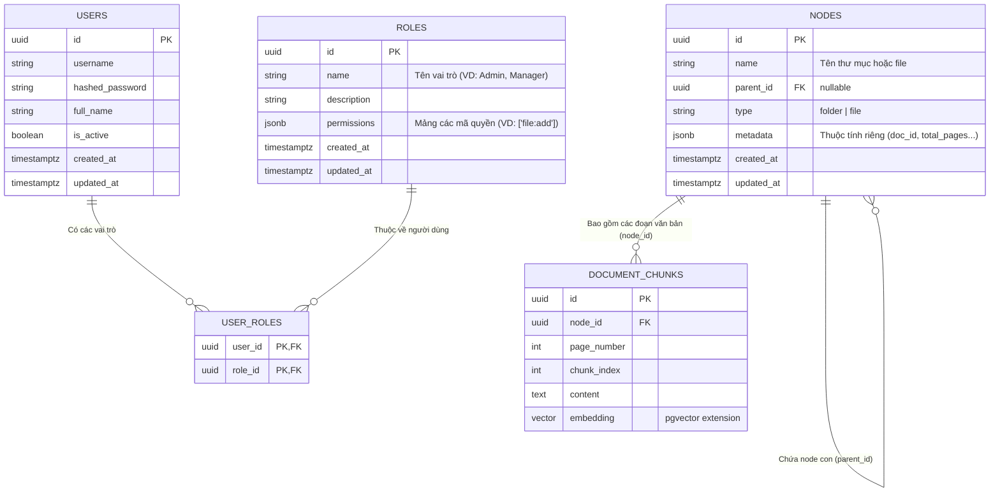

# Database Schema (PostgreSQL + pgvector)

Hệ thống **DocumentSemanticSearch** sử dụng **PostgreSQL** kết hợp với extension **pgvector** làm cơ sở dữ liệu duy nhất. Cách tiếp cận này giúp lưu trữ cả dữ liệu quan hệ (metadata, users, folders) và dữ liệu Vector (embeddings) trên cùng một hệ thống, giúp dễ dàng quản lý, backup và thực hiện các câu truy vấn phức tạp (kết hợp lọc theo metadata và tìm kiếm ngữ nghĩa).

## 1. Biểu đồ quan hệ (ERD)



## 2. Chi tiết các bảng

### 2.1. Bảng `users`
Lưu trữ thông tin tài khoản người dùng và phân quyền hệ thống.

| Tên trường (Column) | Kiểu dữ liệu | Khóa | Ràng buộc (Constraints) | Mô tả |
| :--- | :--- | :--- | :--- | :--- |
| `id` | UUID | PK | Default: gen_random_uuid() | ID định danh người dùng. |
| `username` | Varchar(50) | | Unique, Not Null | Tên đăng nhập. |
| `hashed_password` | Varchar(255)| | Not Null | Mật khẩu đã được băm (bcrypt). |
| `full_name` | Varchar(100)| | Not Null | Tên hiển thị đầy đủ. |
| `is_active` | Boolean | | Default: True | Trạng thái tài khoản (True=Hoạt động). |
| `created_at` | Timestamptz | | Default: Now() | Thời gian tạo tài khoản. |
| `updated_at` | Timestamptz | | Default: Now() | Thời gian cập nhật gần nhất. |
| `deleted_at` | Timestamptz | | Nullable | Lưu thời gian xóa (Soft Delete vào thùng rác). |
| `deleted_by` | UUID | FK | Nullable | ID người thực hiện xóa. |

### 2.2. Bảng `nodes` (Files & Folders)
Lưu trữ chung cấu trúc cây thư mục và thông tin tài liệu. Các thuộc tính riêng của file sẽ được lưu linh hoạt trong trường `metadata` dạng JSONB.

| Tên trường (Column) | Kiểu dữ liệu | Khóa | Ràng buộc (Constraints) | Mô tả |
| :--- | :--- | :--- | :--- | :--- |
| `id` | UUID | PK | Default: gen_random_uuid() | ID định danh nội bộ. |
| `name` | Varchar(255)| | Not Null | Tên file vật lý (vd: `Hop_dong.pdf`) hoặc tên thư mục. |
| `parent_id` | UUID | FK | Nullable | Tham chiếu tới `id` chính bảng `nodes`. Nếu `null` là đối tượng nằm ở thư mục gốc. |
| `type` | Varchar(20) | | Not Null | Phân loại: `folder` hoặc `file`. |
| `metadata` | JSONB | | Nullable | Lưu trữ siêu dữ liệu tùy biến. Với file PDF sẽ chứa: `{"doc_id": "Mã hash MD5", "total_pages": 10, "extension": ".pdf"}` |
| `created_at` | Timestamptz | | Default: Now() | Thời gian khởi tạo. |
| `updated_at` | Timestamptz | | Default: Now() | Thời gian cập nhật gần nhất. |
| `deleted_at` | Timestamptz | | Nullable | Lưu thời gian xóa (Soft Delete vào thùng rác). |
| `deleted_by` | UUID | FK | Nullable | ID người thực hiện xóa file/folder vào thùng rác. |

**Định nghĩa cấu trúc JSON cho cột `metadata`:**

Tùy thuộc vào `type` là `file` hay `folder` mà trường `metadata` sẽ lưu các thông tin khác nhau.

*1. Khi `type = 'file'` (Đặc biệt là file tài liệu PDF, Word, v.v.):*
```json
{
  "doc_id": "8b1a9953c4611296a827abf8c47804d7",
  "storage_path": "/storage/documents/8b1a9953c4611296a827abf8c47804d7.pdf",
  "extension": ".pdf",
  "mime_type": "application/pdf",
  "size_bytes": 1048576,
  "total_pages": 15
}
```
- `doc_id`: (String) Mã băm MD5 hoặc UUID của nội dung file vật lý, dùng để tránh lưu trùng lặp.
- `storage_path`: (String) Đường dẫn tuyệt đối hoặc tương đối trỏ tới vị trí lưu file thực tế trên ổ cứng (hoặc S3/Cloud Storage).
- `extension`: (String) Đuôi mở rộng của file.
- `mime_type`: (String) Kiểu định dạng file chuẩn.
- `size_bytes`: (Integer) Dung lượng file lưu trữ tính bằng byte.
- `total_pages`: (Integer) Tổng số trang trích xuất được (riêng cho các loại tài liệu phân trang như PDF, DOCX).

*2. Khi `type = 'folder'` (Không bắt buộc, dùng cho tuỳ biến giao diện):*
```json
{
  "color": "#FF5733",
  "icon": "folder-star"
}
```
- `color`: (String) Mã màu để highlight thư mục trên UI.
- `icon`: (String) Tên icon nếu muốn hiển thị thư mục đặc biệt.

### 2.3. Bảng `document_chunks`
Bảng này sử dụng kiểu dữ liệu `vector` từ extension **pgvector** của PostgreSQL, cho phép lưu trữ và thực hiện các phép toán tìm kiếm tương đồng (Similarity Search) như Cosine Distance, L2 Distance ngay bằng câu lệnh SQL.

| Tên trường (Column) | Kiểu dữ liệu | Khóa | Ràng buộc (Constraints) | Mô tả |
| :--- | :--- | :--- | :--- | :--- |
| `id` | UUID | PK | Default: gen_random_uuid() | Khóa chính của chunk. |
| `node_id` | UUID | FK | Not Null, Cascade Delete | Tham chiếu tới `id` bảng `nodes` (file). Nếu file bị xóa, toàn bộ chunks tự động mất. |
| `page_number` | Integer | | Not Null | Số thứ tự trang chứa đoạn văn bản này (dành cho PDF Viewer highlight). |
| `chunk_index` | Integer | | Not Null | Số thứ tự của chunk trong trang đó. |
| `content` | Text | | Not Null | Văn bản/câu chữ gốc đã được cắt (Chunk). |
| `embedding` | Vector(D) | | Not Null | Mảng vector số thực. `D` là số chiều tùy thuộc Embedding Model (vd: `vector(768)`). |

*Lưu ý Indexing:* Để tăng tốc độ truy vấn trên tập dữ liệu khổng lồ, cần tạo Index chuyên dụng của `pgvector` (như HNSW hoặc IVFFlat) trên trường `embedding`.
Ví dụ câu lệnh: `CREATE INDEX ON document_chunks USING hnsw (embedding vector_cosine_ops);`

### 2.4. Bảng `roles`
Lưu trữ các nhóm quyền (Role) trong hệ thống.

| Tên trường (Column) | Kiểu dữ liệu | Khóa | Ràng buộc (Constraints) | Mô tả |
| :--- | :--- | :--- | :--- | :--- |
| `id` | UUID | PK | Default: gen_random_uuid() | ID định danh Role. |
| `name` | Varchar(100)| | Unique, Not Null | Tên hiển thị của Role (VD: Admin, Content Manager). |
| `description` | Text | | Nullable | Mô tả ngắn gọn về Role này. |
| `permissions` | JSONB | | Default: '[]' | Mảng chứa các mã quyền. VD: `["file:add", "file:view", "folder:delete"]`. |
| `created_at` | Timestamptz | | Default: Now() | Thời gian tạo. |
| `updated_at` | Timestamptz | | Default: Now() | Thời gian cập nhật gần nhất. |

### 2.5. Bảng `user_roles`
Bảng trung gian gán Role cho User (hỗ trợ 1 User có thể có nhiều Role).

| Tên trường (Column) | Kiểu dữ liệu | Khóa | Ràng buộc (Constraints) | Mô tả |
| :--- | :--- | :--- | :--- | :--- |
| `user_id` | UUID | PK, FK| Not Null, Cascade Delete | Tham chiếu tới bảng `users`. |
| `role_id` | UUID | PK, FK| Not Null, Cascade Delete | Tham chiếu tới bảng `roles`. |
